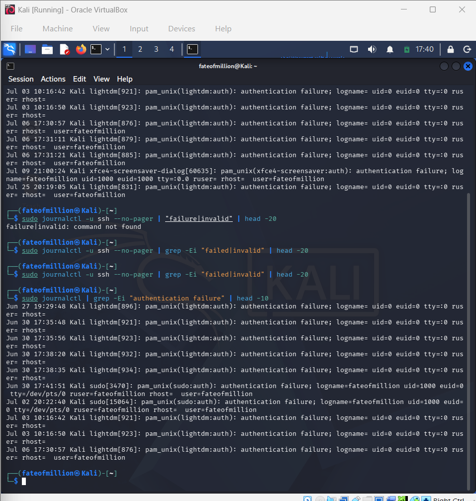
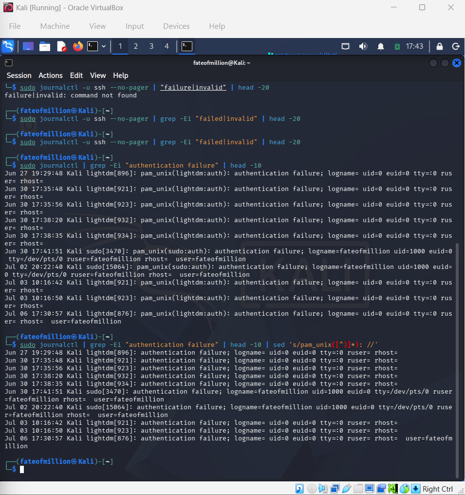
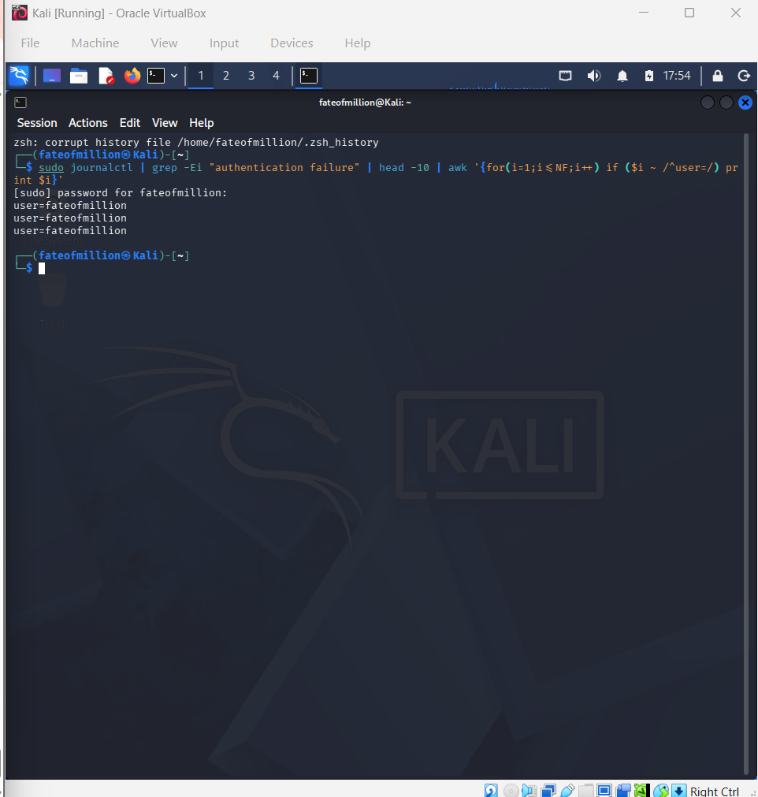

# Day 17 — Linux Log Analysis with grep, sed and awk

## Objective

Practice using `grep`, `sed`, and `awk` for manual log analysis using real authentication events from Kali Linux.

The goal was to search, clean, and extract useful information from raw system logs using command-line tools commonly used during security investigations.

## Environment

* Kali Linux
* systemd journal
* `journalctl`
* `grep`
* `sed`
* `awk`

## Log Source

My Kali system did not have `/var/log/auth.log`, so I used the systemd journal to access authentication events.

```bash
sudo journalctl
```

## 1. grep — Find Authentication Failures

```bash
sudo journalctl | grep -Ei "authentication failure" | head -10
```

### What it does

Searches the system journal for authentication failure events and displays the first 10 matching entries.

`grep` is useful for quickly filtering large amounts of log data and locating relevant security events.

### Evidence



---

## 2. sed — Clean Log Output

```bash
sudo journalctl | grep -Ei "authentication failure" | head -10 | sed 's/pam_unix([^)]*): //'
```

### What it does

Removes the `pam_unix(...)` portion from the authentication log entries.

This makes the important authentication information easier to read by removing unnecessary technical details.

### Evidence



---

## 3. awk — Extract a Specific Field

```bash
sudo journalctl | grep -Ei "authentication failure" | head -10 | awk '{for(i=1;i<=NF;i++) if($i ~ /^user=/) print $i}'
```

### What it does

Searches each log entry for a field beginning with `user=` and prints that field.

`awk` is useful for extracting specific fields from structured or semi-structured log data.

### Evidence



---

## Important Observation

The authentication events available on this Kali system did not contain a remote source IP address.

I also checked the SSH logs for failed remote login attempts, but no failed SSH authentication events were available.

Therefore, no source IP was fabricated or extracted from unrelated log fields.

## Skills Practiced

* Linux log analysis
* Manual log triage
* Authentication event analysis
* `journalctl`
* `grep`
* `sed`
* `awk`
* Pattern matching
* Log filtering
* Field extraction
* Command-line text processing

## SOC Relevance

Security analysts often inspect raw logs during the initial stages of an investigation.

`grep`, `sed`, and `awk` can be used to:

* Find relevant security events
* Filter large amounts of log data
* Remove unnecessary information
* Extract useful fields
* Prepare log data for further investigation

## Key Takeaway

This lab practiced the basic command-line log-analysis workflow:

**Search → Filter → Clean → Extract → Investigate**

The exercise was completed using real authentication events from a Kali Linux system.
