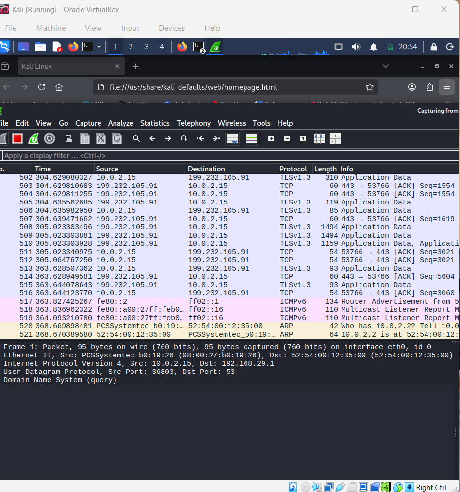
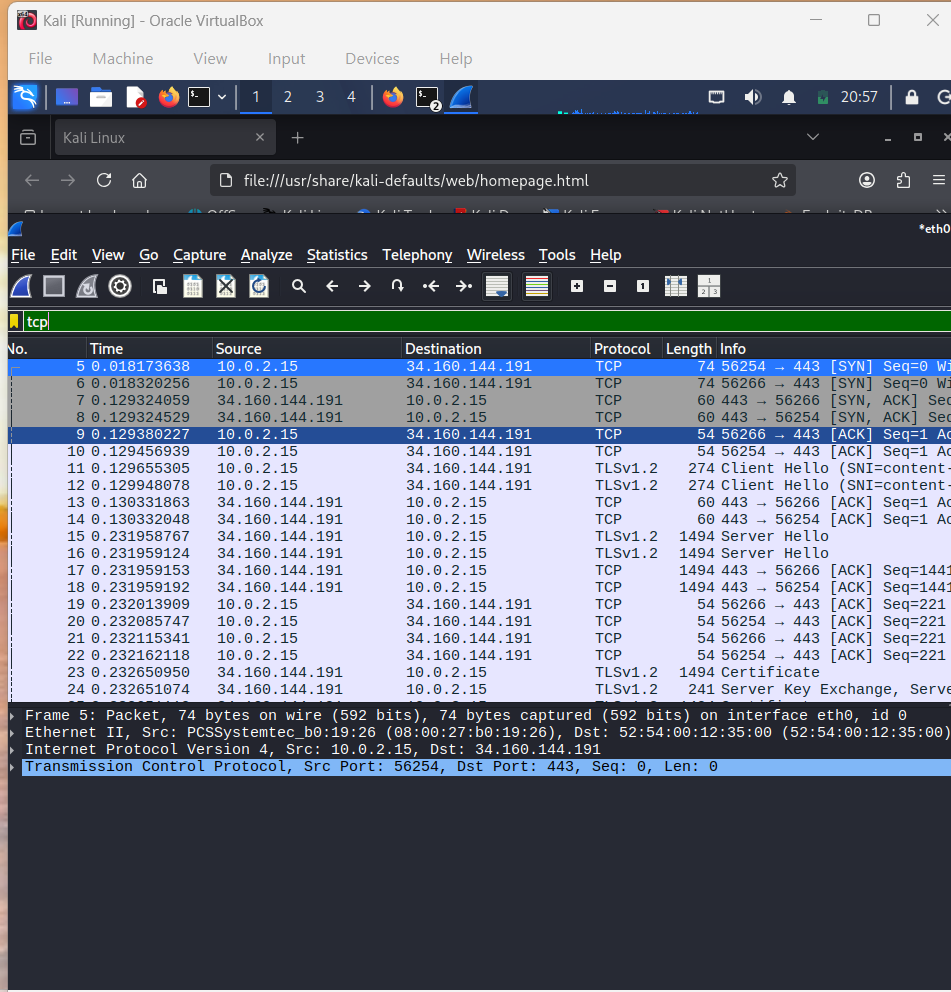
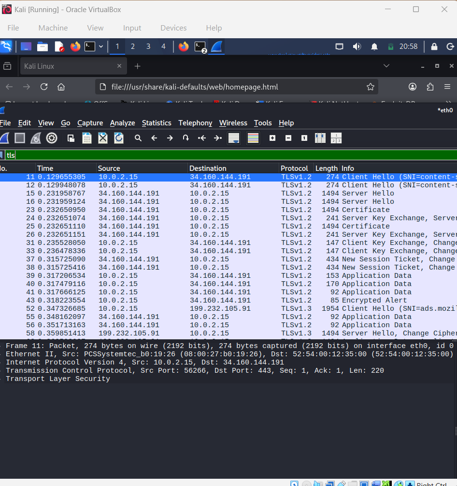
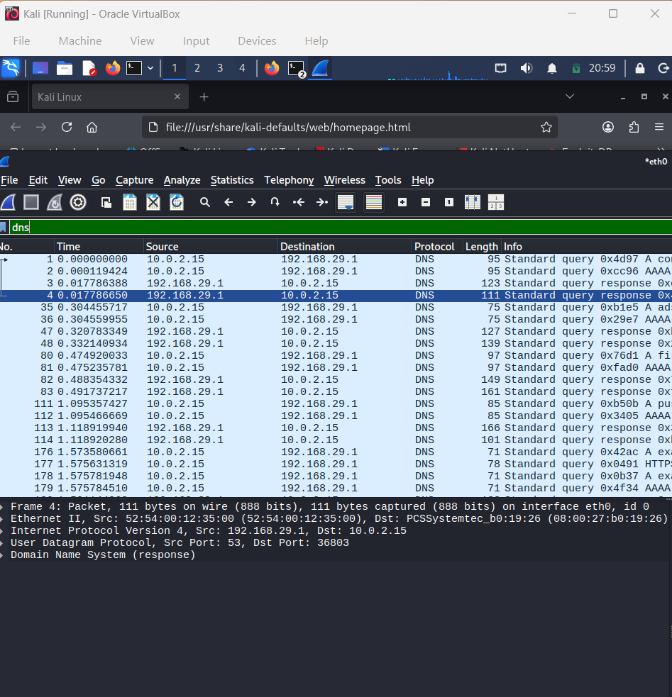
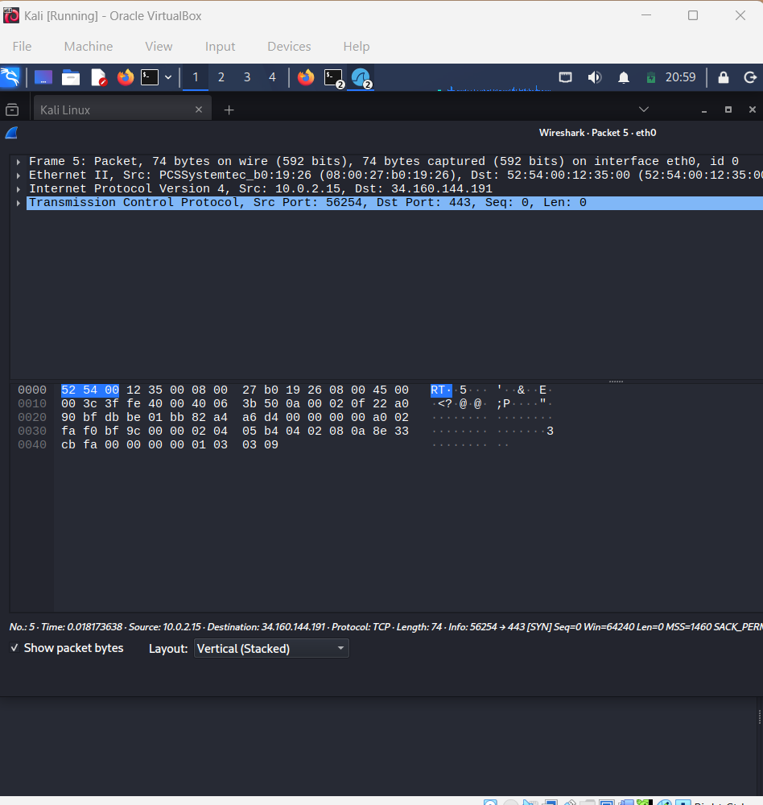

# Firewalls, NAT, VPN & Wireshark

## Overview

This lab focuses on fundamental networking concepts that are essential for cybersecurity and Blue Team operations. I learned how firewalls filter network traffic, how routers forward packets, how NAT enables private devices to access the internet, how VPNs protect network traffic, and how to capture and analyze packets using Wireshark.

---

## Objectives

- Understand the purpose of firewalls
- Learn the difference between stateful and stateless firewalls
- Understand routing and default gateways
- Learn how Network Address Translation (NAT) works
- Understand port forwarding
- Learn what a VPN encrypts
- Install and use Wireshark
- Capture and analyze live network traffic

---

## Tools Used

- Kali Linux
- Wireshark
- Firefox
- VirtualBox

---

## Topics Covered

- Firewalls
- Stateful vs Stateless Firewalls
- Routing
- Default Gateway
- Network Address Translation (NAT)
- Port Forwarding
- Virtual Private Networks (VPNs)
- Packet Capture
- Network Protocol Analysis

---

## Practical Lab

### 1. Installed Wireshark

Installed Wireshark in Kali Linux and verified that the network interface was available for packet capture.

### 2. Captured Live Traffic

Captured live network traffic while browsing websites such as GitHub, Google, and YouTube.

### 3. Applied Display Filters

Used Wireshark display filters to isolate specific network protocols including:

- TCP
- TLS
- DNS

### 4. Inspected Packet Details

Examined packet information including:

- Ethernet II
- IPv4
- TCP
- Source IP Address
- Destination IP Address
- Port Numbers

---

## Protocols Observed

- TCP
- TLS
- DNS
- ICMPv6

---

## Key Concepts Learned

### Firewall

A firewall monitors and filters incoming and outgoing network traffic according to predefined security rules.

### Stateful Firewall

Tracks active network connections and makes filtering decisions based on the connection state.

### Stateless Firewall

Examines each packet independently without remembering previous packets.

### Routing

Routers forward packets between different networks based on the destination IP address.

### NAT (Network Address Translation)

Allows multiple private IP addresses to share a single public IP address while hiding the internal network structure.

### Port Forwarding

Forwards incoming traffic from a specific public port to a device inside a private network.

### VPN

Encrypts data transmitted between the user's device and the VPN server, protecting traffic from interception.

---

## Screenshots

### Live Packet Capture

### TCP Filter

### TLS Filter

### DNS Filter

### Packet Details

---

## Key Takeaways

- Learned how packets travel across networks.
- Understood how routers and firewalls work together.
- Learned how NAT hides internal IP addresses.
- Captured and analyzed live traffic using Wireshark.
- Gained hands-on experience identifying network protocols using display filters.

---

## Skills Developed

- Network Fundamentals
- Packet Analysis
- Wireshark
- Network Troubleshooting
- TCP/IP
- Firewall Concepts
- Routing
- NAT
- VPN Fundamentals

---

**Status:** ✅ Completed
