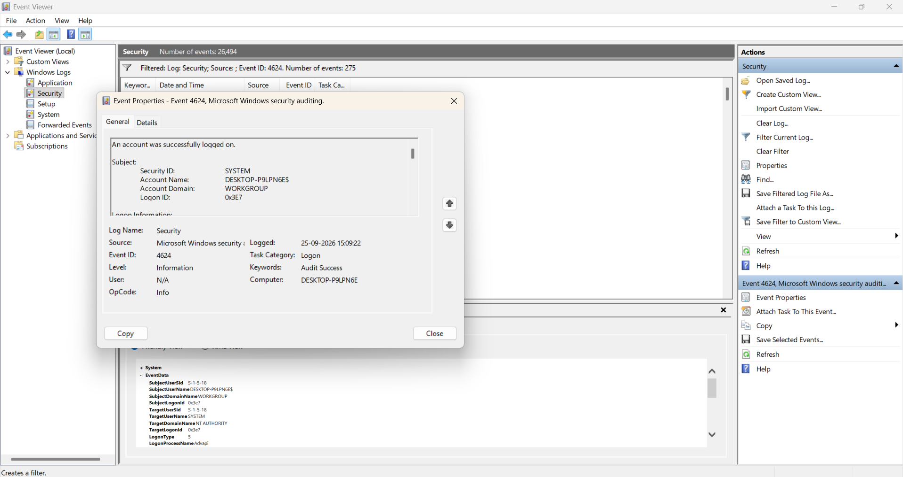
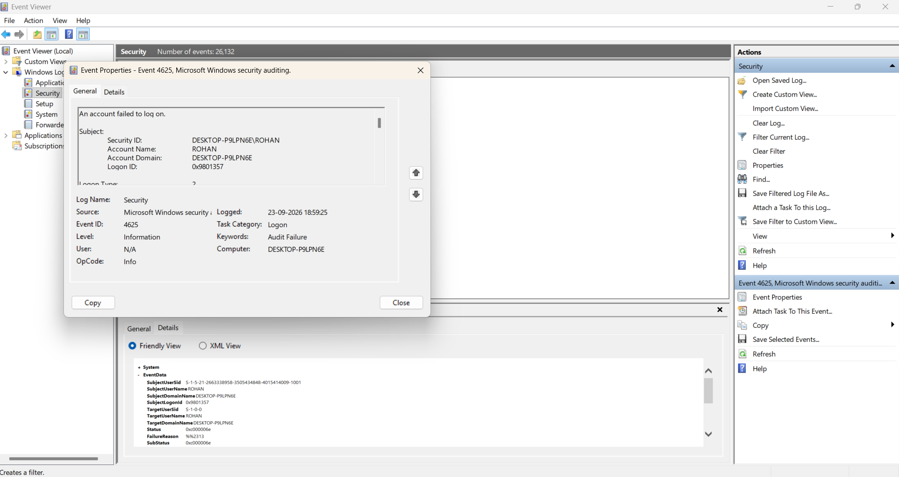

# Day 16 — Windows Event IDs & Linux Review

## 🎯 Objective

Refresh important Linux commands and investigate Windows Security Event IDs commonly used in SOC monitoring.

The main focus was understanding how Windows authentication events appear in Event Viewer and how Linux commands can be used for basic security investigation.

---

## 🪟 Windows Event Viewer

### Event ID 4624 — Successful Logon

**Meaning:** A user or account successfully logged on.

During the investigation, I found a 4624 event associated with the `SYSTEM` account.

- Logon Type: 5
- Account: SYSTEM
- Logon Process: Advapi
- Result: Audit Success

**Observation:**  
A 4624 event does not always mean a person logged into the computer. Logon Type 5 indicates a service logon.



---

### Event ID 4625 — Failed Logon

**Meaning:** A logon attempt failed.

During the investigation, I found a 4625 event for the `ROHAN` account.

- Logon Type: 2
- Result: Audit Failure
- Failure Reason: `0xC000006D`
- SubStatus: `0xC000006E`

**Observation:**  
A single failed logon does not necessarily indicate malicious activity. A SOC analyst would examine the frequency, account, source, timing, and surrounding events to identify suspicious patterns.



---

## 🔑 Five Important Windows Event IDs

| Event ID | Meaning | SOC Relevance |
|---|---|---|
| **4624** | Successful logon | Monitor authentication activity |
| **4625** | Failed logon | Investigate repeated authentication failures |
| **4688** | Process creation | Investigate suspicious processes or commands |
| **4720** | User account created | Detect unexpected account creation |
| **4672** | Special privileges assigned | Monitor elevated privilege activity |

---

## 🐧 Linux Commands Reviewed

### `ps aux`

Displays currently running processes from all users.

Useful for identifying processes, process owners, resource usage, and commands during investigation.

### `chmod`

Changes file permissions.

Example:

```bash
chmod g-w text.txt
